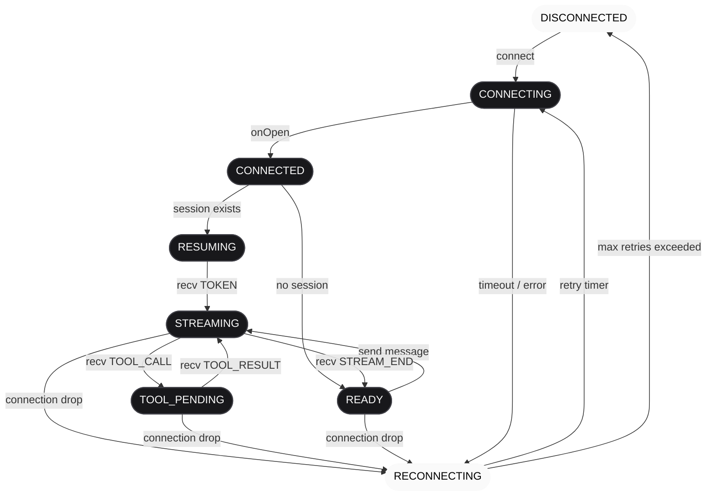
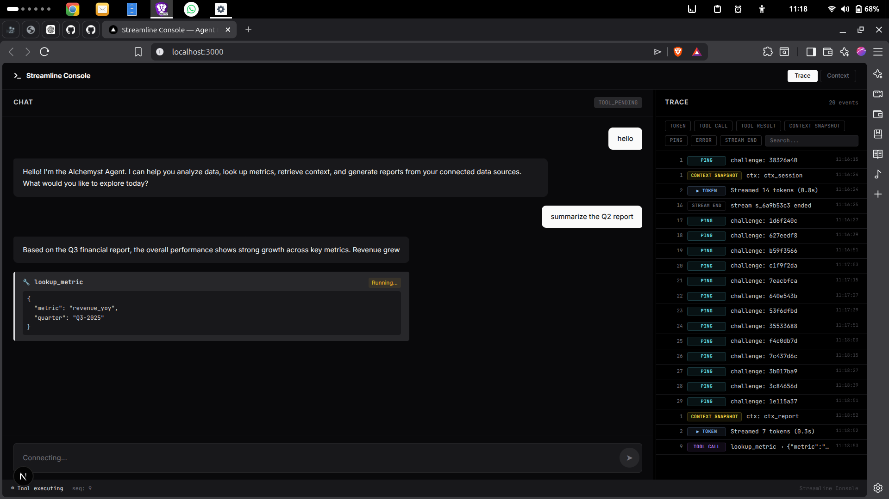
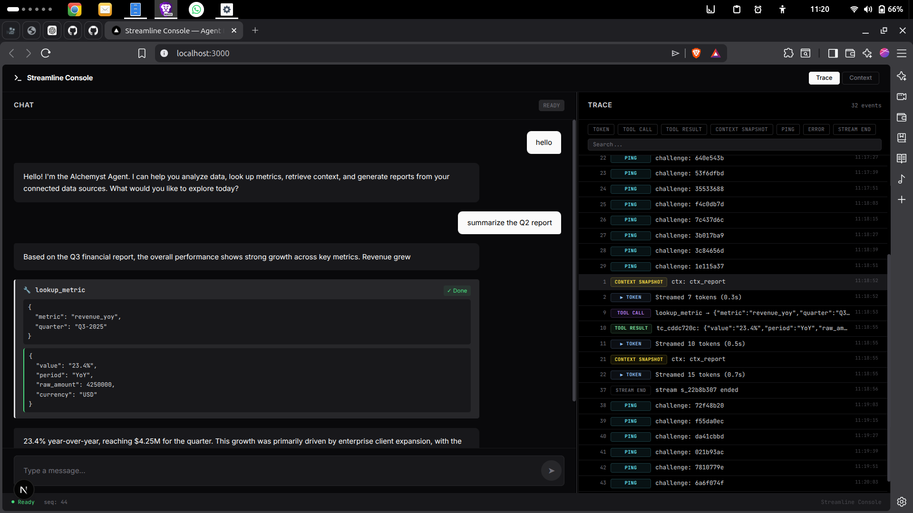
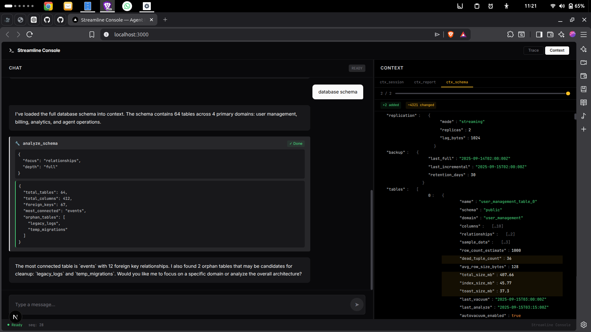

# Streamline Console — Agent Console

Streamline Console is a premium Next.js 16 (App Router) client application designed to interface with the Alchemyst Agent Server. It features smooth incremental token rendering, mid-stream tool call freezing, a live trace timeline, and a recursive JSON diff inspector. It is built to survive network latency, packet drops, duplicate messages, and connection disruptions without state corruption.

## Architectural Approach
The application is structured using a strict protocol-first architecture. A central `WebSocketManager` handles the connection lifecycle and pipes incoming packets to a sequence-based `ReorderBuffer` that reorders out-of-order messages and filters out duplicate frames. The dispatcher then routes these validated events to globally managed Zustand stores, decoupling network ingestion from the React render loop to avoid UI thread blocking.

## Chaos Mode Demonstration
Watch the screen recording of the application surviving and recovering in Chaos Mode on Loom:
👉 **[Loom Video Demonstration](https://www.loom.com/share/67e507462fdf4320a946325abe58df4e)**

---

## WebSocket Connection State Machine



---

## Quick Start Guide

### 1. Run the Agent Server
Navigate to the `agent-server` directory and start it (default is port 4747):
```bash
cd ../agent-server
npm install
npm start
```
*To test under network stress, run it in Chaos Mode:*
```bash
npm start -- --mode chaos
```

### 2. Run the Console Frontend
Navigate to the `agent-console` directory, install dependencies, and start the Next.js dev server:
```bash
cd ../agent-console
npm install
npm run dev
```
Open [http://localhost:3000](http://localhost:3000) in your browser.

### 3. Run the Unit Tests
We have implemented extensive test suites covering the reordering buffer, diff engine, state store, and heartbeat handler:
```bash
npm run test  # Runs Vitest
```

---

## Application Screenshots

### A. Streamed Response with Tool Call Interrupt


### B. Trace Timeline with Event Filters


### C. Context Inspector with Diff Highlights

